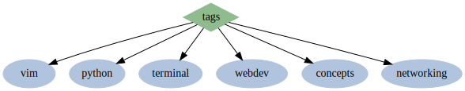

<h1 align="center"><code>$ til</code></h1>

welcome to my "today i learned" repository - it's filled with short entries of information for my own reference & retention 📓

  <a href="tags.html">tags</a> 

<h2 id="vim">vim</h2>
<ul>
  <li>
    <a href="posts/vim-cli.html">vim commandline</a>
  </li>
  <li>
    <a href="posts/remove-trailing-whitespace.html">remove trailing whitespace in vim</a>
  </li>
  <li>
    <a href="posts/replacing-words-in-vim.html">replace words in vim</a>
  </li>
</ul>
<h2 id="webdev">webdev</h2>
<ul>
  <li>
    <a href="posts/html-meta-tags.html">every html meta tag</a>
  </li>
  <li>
    <a href="posts/markdown-details-collapsible.html">collapsible sections in markdown</a>
  </li>
  <li>
    <a href="posts/git-master-to-main.html">git change branch master to main</a>
  </li>
  <li>
    <a href="posts/common-mime-types.html">common mime types</a>
  </li>
</ul>
<h2 id="terminal">terminal</h2>
<ul>
  <li>
    <a href="posts/bash-color-codes.html">bash color codes</a>
  </li>
  <li>
    <a href="posts/bash-script-conditions.html">bash script conditions</a>
  </li>
  <li>
    <a href="posts/crontab-guide.html">crontab guide</a>
  </li>
</ul>
<h2 id="networking">networking</h2>
<ul>
  <li>
    <a href="posts/remote-termux.html">termux remote</a>
  </li>
</ul>
<h2 id="concepts">concepts</h2>
<ul>
  <li>
    <a href="posts/straw-man.html">straw man</a>
  </li>
  <li>
    <a href="posts/stop-usrbinenv.html">stop #!/usr/bin/env in scripts</a>
  </li>
</ul>
<h2 id="python">python</h2>
<ul>
  <li><a href="posts/python-shell.html">python shell</a></li>
</ul>