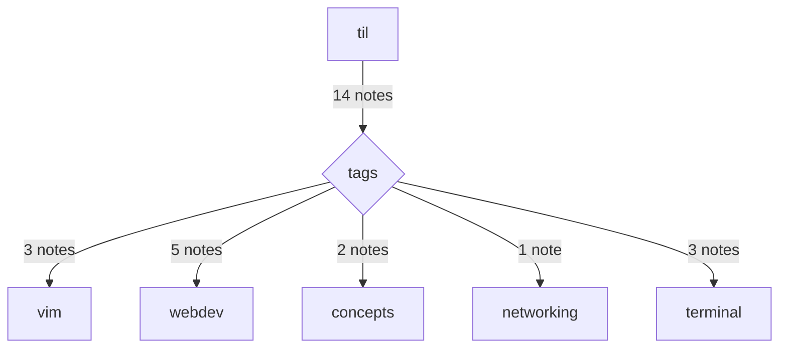

<h1 align="center"><code>$ til</code></h1>

welcome to my "today i learned" repository - it's filled with short entries of information for my own reference & retention 📓

  <a href="#vim">vim</a> •
  <a href="#webdev">webdev</a> •
  <a href="#terminal">terminal</a> •
  <a href="#networking">networking</a> •
  <a href="#concepts">concepts</a> 

## vim
- [vim commandline](vim/vim-cli.md)
- [remove trailing whitespace in vim](vim/remove-trailing-whitespace.md)
- [replace words in vim](vim/replacing-words.md)

## webdev
- [every html meta tag](webdev/html-meta-tags.md)
- [collapsible sections in markdown](webdev/markdown-details-collapsible.md)
- [python shell](webdev/python-shell.md)
- [git change branch master to main](webdev/git-master-to-main.md)
- [common mime types](webdev/common-mime-types.md)

## terminal
- [bash color codes](terminal/bash_color_codes.md)
- [bash script conditions](terminal/bash_script_conditions.md)
- [crontab guide](terminal/crontab-guide.md)

## networking
- [termux remote](networking/remote-termux.md)

## concepts
- [straw man](concepts/straw-man.md)
- [stop #!/usr/bin/env in scripts](concepts/stop-usrbinenv.md)

## python
- [python shell](posts/python-shell.md)
