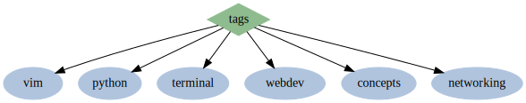

<h1 class="important">Glossary of tags</h1>

  <a href="#vim">#vim</a> •
  <a href="#webdev">#webdev</a> •
  <a href="#terminal">#terminal</a> •
  <a href="#networking">#networking</a> •
  <a href="#concepts">#concepts</a> •
  <a href="#python">#python</a> 

## vim
- [vim commandline](posts/vim-cli.html)
- [remove trailing whitespace in vim](posts/remove-trailing-whitespace.html)
- [replace words in vim](posts/replacing-words-in-vim.html)

## webdev
- [every html meta tag](posts/html-meta-tags.html)
- [collapsible sections in markdown](posts/markdown-details-collapsible.html)
- [git change branch master to main](posts/git-master-to-main.html)
- [common mime types](posts/common-mime-types.html)

## terminal
- [bash color codes](posts/bash-color-codes.html)
- [bash script conditions](posts/bash-script-conditions.html)
- [crontab guide](posts/crontab-guide.html)

## networking
- [termux remote](posts/remote-termux.html)

## concepts
- [straw man](posts/straw-man.html)
- [stop #!/usr/bin/env in scripts](posts/stop-usrbinenv.html)

## python
- [python shell](posts/python-shell.html)

<a href="index.html">⭠</a>

